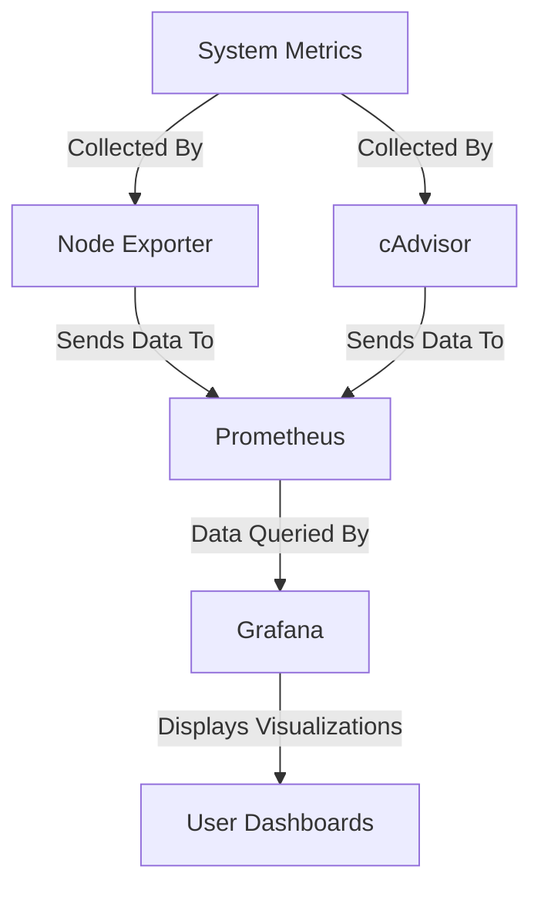

# Observability for Self-Hosting

Observability is crucial for ensuring the health and performance of self-hosted systems. It allows me to have a overview on performance, uptime, and resource usage of hardware and services, helping to troubleshoot issues before they impact me.

## Benefits of Using Grafana, Prometheus, cAdvisor, and Node Exporter:

- **Grafana**: Provides powerful and customizable dashboards for visualizing metrics from Prometheus and other sources, offering insights into system health and performance.
- **Prometheus**: A time-series database used to collect and store metrics from various systems. It enables real-time monitoring and alerting for efficient troubleshooting.
- **cAdvisor**: Monitors containerized applications and provides metrics such as CPU, memory, and network usage, allowing for deep insights into container performance.
- **Node Exporter**: Collects hardware and OS-level metrics (CPU, disk usage, memory, etc.) from physical or virtual machines, enabling comprehensive monitoring of your infrastructure.

## Purpose of the Tools:
These tools work together to provide a comprehensive observability stack that helps monitor and visualize the health of your self-hosted environment.

Here is a simple flow chart:

### Dashboards:

#### Example 1: Node Exporter Dashboard

#### Example 2: Dashboard 2

