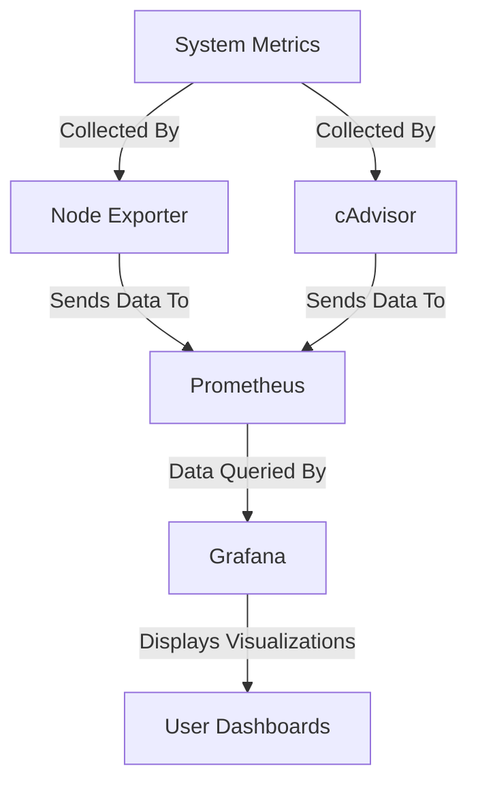
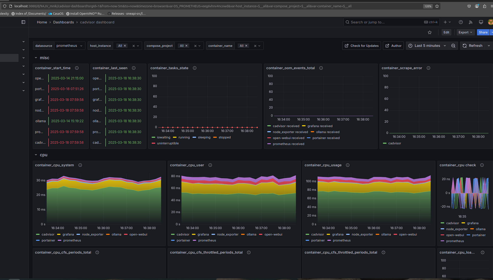
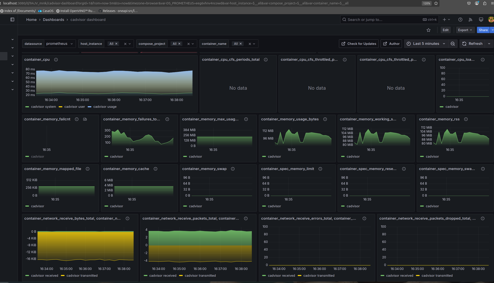
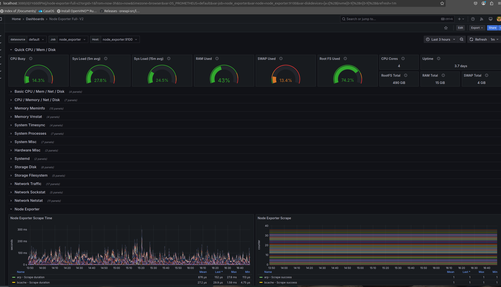
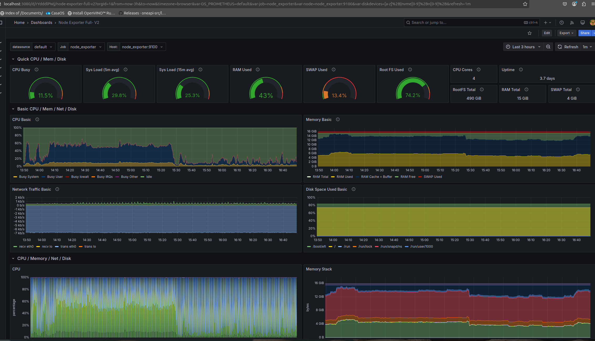

# Observability for Self-Hosting

Observability is crucial for ensuring the health and performance of self-hosted systems. It allows me to have a overview on performance, uptime, and resource usage of hardware and services, helping to troubleshoot issues before they impact me.

## Benefits of Using Grafana, Prometheus, cAdvisor, and Node Exporter:

- **Grafana**: Provides powerful and customizable dashboards for visualizing metrics from Prometheus and other sources, offering insights into system health and performance.
- **Prometheus**: A time-series database used to collect and store metrics from various systems. It enables real-time monitoring and alerting for efficient troubleshooting.
- **cAdvisor**: Monitors containerized applications and provides metrics such as CPU, memory, and network usage, allowing for deep insights into container performance.
- **Node Exporter**: Collects hardware and OS-level metrics (CPU, disk usage, memory, etc.) from physical or virtual machines, enabling comprehensive monitoring of your infrastructure.

## Purpose of the Tools:
These tools work together to provide a comprehensive observability stack that helps monitor and visualize the health of your self-hosted environment.

### **The Three Pillars of Observability**  

Observability relies on **three key pillars** to provide a complete understanding of system health and performance:  

- **Traces** track the flow of a request across multiple services, helping to identify bottlenecks, latency issues, and dependencies in distributed systems.  
- **Metrics** provide numerical data on system performance (e.g., CPU usage, memory consumption, request rates), allowing for real-time monitoring and alerting.  
- **Logs** capture detailed event records, storing contextual information about system activities, errors, and debugging insights.  

For my **self-hosting setup**, I decided to focus solely on **metrics** and **dashboards** because they provide a lightweight and efficient way to monitor system performance without the added complexity of managing logs and traces. With **Grafana and Prometheus**, I can visualize key resource usage in real-time, ensuring optimal performance while keeping resource overhead minimal. 🚀  

### Dashboards:

#### Example 1: Node Exporter Dashboard  
  
  

#### Example 2: cAdvisor Dashboard  
  
  

### **Alerting & channels**  
- Content to be added

### **Splunk**    
- Content to be added

### **AppDynamics**    
- Content to be added
