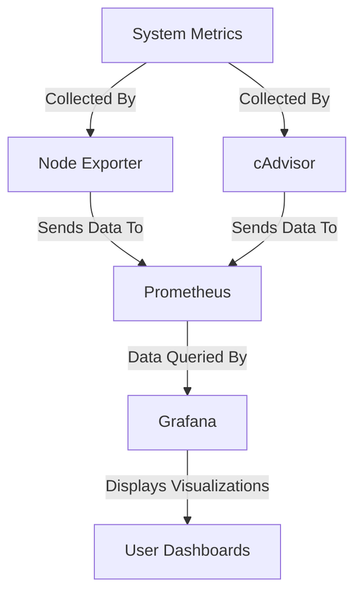

For my **self-hosting setup**, I decided to focus solely on **metrics** and **dashboards** because they provide a lightweight and efficient way to monitor system performance without the added complexity of managing logs and traces. With **Grafana and Prometheus**, I can visualize key resource usage in real-time, ensuring optimal performance while keeping resource overhead minimal. 🚀  

### Dashboards:

#### Example 1: Node Exporter Dashboard  
  
  

#### Example 2: cAdvisor Dashboard  
  
  