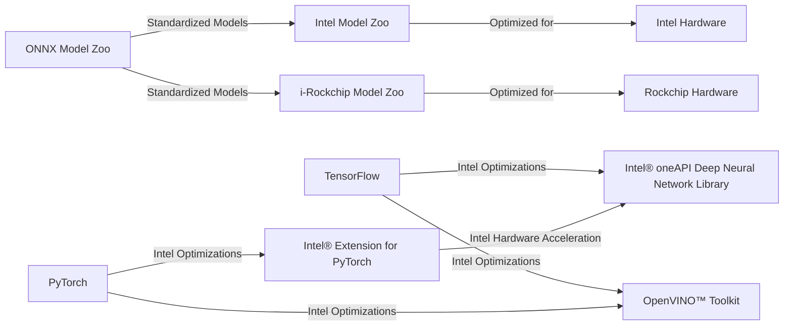

# Model Zoos

A **Model Zoo** is a collection of pre-trained machine learning models, often optimized for specific hardware or frameworks. These model repositories make it easier for developers and researchers to deploy, test, and experiment with models without having to build them from scratch.

## ONNX Model Zoo
The **ONNX Model Zoo** is a rich collection of pre-trained models in the **ONNX (Open Neural Network Exchange)** format. These models are sourced from open-source repositories and contributions from the community. ONNX enables a standardized format that ensures compatibility across different frameworks, tools, and runtimes, which is ideal for cross-platform deployment.

Key Features:
- **Standardized format** for interoperability.
- **Git LFS** (Large File Storage) to manage large model files.
- [GitHub Repository](https://github.com/onnx/models) for accessing models.

## Intel Model Zoo
The **Intel Model Zoo** offers a comprehensive selection of optimized deep learning models tailored for Intel hardware, such as CPUs, GPUs, and specialized accelerators. These models are part of Intel's broader AI software stack, enabling high-performance inference and training.

Key Features:
- **Optimized for Intel hardware** (CPUs, GPUs, VPUs).
- **Includes pre-trained models** and deployment scripts.
- [GitHub Repository](https://github.com/openvinotoolkit/open_model_zoo) for easy access.

## i-Rockchip Model Zoo
The **i-Rockchip Model Zoo** focuses on AI models optimized for **Rockchip** hardware, especially designed for efficient inference on embedded and edge devices. It includes models for various applications, including vision, speech, and edge computing.

Key Features:
- **Tailored for Rockchip's AI accelerators**.
- **Pre-trained models** for vision, speech, and edge computing.
- [GitHub Repository](https://github.com/rockchip-linux/rknn-model-zoo) for quick access.

There are also several other **model zoos** from companies like NVIDIA, but my personal experience is primarily with Intel and Rockchip-based devices.

---

## Common Deep Learning Frameworks  

### TensorFlow
- **TensorFlow** is an open-source deep learning framework developed by **Google**. It provides a flexible ecosystem for training and deploying machine learning models across various platforms, including **cloud**, **edge**, and **mobile** devices. TensorFlow is known for its robust support of both high-level APIs like Keras and low-level operations, giving users fine-grained control over their models.
  
  Key Features:
  - **Ecosystem for training & deployment** on diverse platforms.
  - **Supports Keras** for easy model building.
  - **Flexible and scalable** for large-scale applications.

### PyTorch
- **PyTorch**, developed by **Facebook (Meta)**, is an open-source deep learning framework that is highly favored in the research community. It is known for its **dynamic computation graph**, which allows for flexible and intuitive experimentation. PyTorch is widely used in research and production applications, especially where rapid prototyping is needed.

  Key Features:
  - **Dynamic computation graph** for flexibility.
  - **Widely adopted in research** and industry.
  - **Easy to use** and debug, making it ideal for experimentation.

---

## Intel Adaptations for TensorFlow and PyTorch

Intel provides several performance optimizations and libraries to accelerate **TensorFlow** and **PyTorch** models on Intel platforms. These adaptations are designed to fully leverage Intel's hardware, including **CPUs**, **GPUs**, and **AI accelerators**.

### 1. **Intel® oneAPI Deep Neural Network Library (oneDNN)**
   - **Integration with TensorFlow** to optimize deep learning operations and improve performance on Intel processors. This library accelerates key deep learning tasks, including convolutions, matrix multiplications, and more.

### 2. **Intel® Extension for PyTorch**
   - Optimizes PyTorch models to run efficiently on Intel hardware, including both **CPU** and **GPU** accelerations.

### 3. **OpenVINO™ Toolkit**
   - A comprehensive toolkit that supports both **TensorFlow** and **PyTorch** models, enabling them to be deployed efficiently on **Intel hardware** such as **CPUs**, **GPUs**, and **VPUs**.

### 4. **Intel® Optimization for TensorFlow**
   - Provides specialized optimizations that accelerate model **training** and **inference** when using TensorFlow on Intel platforms, ensuring better performance and scalability.

### 5. **Intel® Extension for PyTorch (IPEX)**
   - Focused on improving **PyTorch's performance** by utilizing **Intel-specific hardware features** and **parallelism**.

These adaptations empower developers to maximize the efficiency, scalability, and performance of their TensorFlow and PyTorch models on Intel hardware.

---

## Model Zoo Relationships

The following diagram illustrates how different model zoos and Intel adaptations interconnect, providing insights into the relationships between the various hardware-specific model repositories and frameworks.

